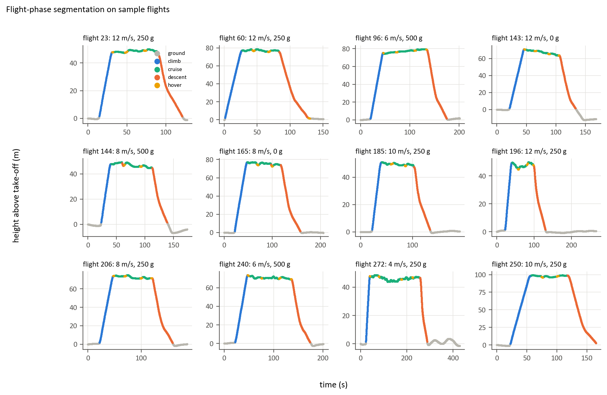
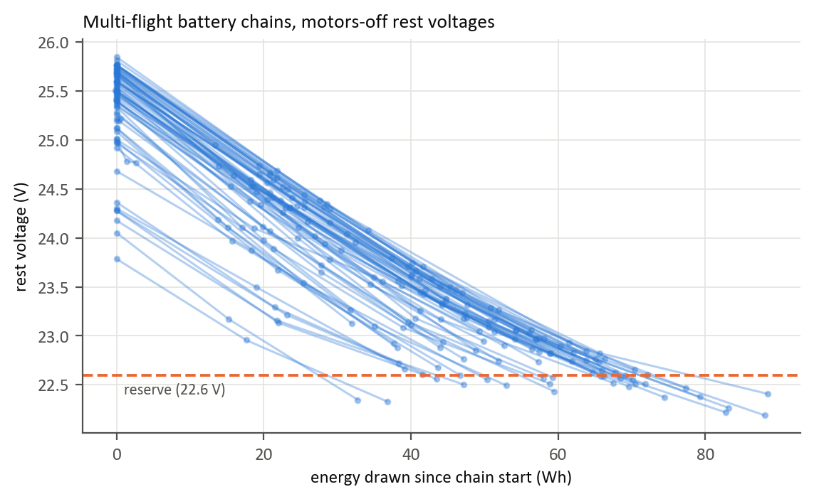

# EnduroSense data report (Phase 1)

**Purpose:** guide checkpoint 1. It covers what the data contains after cleaning, how flights are split into phases, how battery chains were rebuilt, and how the locked train/test split was made.
**Reproduce:** `python scripts/02_prepare_data.py` then `python scripts/03_make_split.py`
**Figures:** `results/phase1/figures/`
**Revision:** 2026-10-02, after the verification pass (see §0)

## 0. Verification pass: what changed

A second, adversarial check of Phases 0 and 1 found and fixed the following.

1. **Flights were put in the wrong order on 7 days.**
   - The cause: start times are text such as `"9:22"`, and sorted as text `"9:22"` comes after `"10:05"`.
   - Battery chains are built by comparing each flight with the one before it, so some chains were broken apart.
   - The fix: every ordering now uses the real timestamp (`clean.start_time()` / `clean.chronological()`), and a test checks single-digit hours.
2. **Four start times are mis-logged in the raw data.** They are corrected in code from `config/time_corrections.yaml`; the raw files are not edited.

   | Flight | Logged | Corrected | Evidence |
   |---|---|---|---|
   | 108 | 22:31 | 10:31 | 12-hour entry; continues into 109 (+0.20 V) |
   | 112 | 10:06 | 11:06 | continues 111 (+0.08 V); 113 starts on a fresh battery |
   | 150 | 3:10 | 15:10 | 12-hour entry; continues 149 (+0.11 V) into 151 (+0.10 V) |
   | 173 | 11:17 | 12:17 | continues 172 (+0.07 V) into 174 (+0.06 V) |

   **Independent check:** after the corrections, flight-ID order matches time order for all 209 flights. The dataset numbers its flights chronologically, and a test now checks this.
3. **Effect on chains:** 9 pairs of wrongly separated chains are now joined (for example 77–80 and 149–152), each checked visually. That gives 90 chains instead of 101, and 71 multi-flight chains covering 190 flights instead of 68 covering 176.
4. **The locked split v1 became invalid.** Four corrected chains crossed the dev/test boundary, which the split's consistency check detected. **Split v2** was made from the corrected chains, and its folds now balance cruise flights rather than all flights. No model had been trained and no test data had been looked at, so making a new split doesn't compromise the evaluation.
5. **Smaller fixes:**
   - Two tests had the same text-sort bug, so they passed by repeating it. They're fixed.
   - `set_seed()` no longer claims to set Python's hash seed, which has no effect inside a running process.
   - The Phase 0 profile now uses the correct order: 92 chains, 64 multi-flight and 28 full-to-reserve, instead of 103, 62 and 25.
6. **Checked and confirmed correct (no change needed):**
   - The 408 readings labelled "ground" more than 5 m up are all after landing (current about 0 A); the altitude reading drifts.
   - Measured maximum height matches the planned altitude to within ±8 m on every flight.
   - Per-flight cruise power matches an independent recalculation (to about 10⁻¹³ W).
   - Making the split twice gives the identical result.

## 1. Cleaning

| Check | Result | Action |
|---|---|---|
| Missing values | none | — |
| Out-of-order timestamps within a flight | none | — |
| Mis-logged flight start times | 4 (see §0) | corrected from `config/time_corrections.yaml`, each with evidence |
| Recording gaps over 1 s | 10 (largest 5.3 s) | Energy is integrated across gaps, so none is lost; each gap is flagged |
| Voltage/current outside physical limits | none | — |
| Large voltage jumps | real load changes: they mirror current jumps (correlation −0.93) | kept |
| Glitches that no load change explains | 22 voltage and 54 current readings (0.03%) | replaced by the 5-reading median and flagged |
| Slightly negative current (to −0.33 A) | 29,031 readings, all with motors off | kept (sensor offset) |
| Flights with no GPS | 211–219 (ground tests A1–A3) | expected; not used for mission modelling |
| Mixed `altitude` column (e.g. `"25-50-100-25"`) | 2 flights change altitude en route | parsed into `alt_cruise_m` and `varying_altitude` |

**Correction to the plan document.** In this dataset `velocity_z` is positive going **up** (correlation with the rate of altitude change is +0.77), even though the README describes a north-east-down frame. With the sign handled correctly, **climbing uses about 17% of energy and descending about 22%**. The project plan had these the wrong way round; it has been corrected.

## 2. Flight phases

Each reading is labelled **ground, climb, cruise, descent or hover**, using height above take-off, vertical speed, horizontal speed and battery current. With the motors off (under 2 A) the drone must be on the ground; this matters because after landing the altitude reading drifts by up to about 14 m (up or down). Fragments shorter than 1 s are merged into the previous phase.

- **195 of 196** cruise flights follow the expected order: ground → climb → cruise → descent → ground (hover may appear in the air).
- **Flight 250**'s recording stops 2.6 m above the ground while it is still descending. It is flagged `truncated_landing` and left out of the descent-energy and whole-mission targets.

| Phase | Share of energy | Share of time | Mean per flight (Wh) | Mean power |
|---|---|---|---|---|
| Cruise | 50.4% | 39.6% | 10.7 | 512 W |
| Descent | 22.0% | 17.7% | 4.7 | 500 W |
| Climb | 16.5% | 11.1% | 3.5 | 599 W |
| Hover | 5.6% | 4.3% | 1.2 | 532 W |
| Ground | 5.5% | 27.3% | 1.2 | — |

**Findings for Model B:**
- **Cruise power barely depends on speed:** about 510 W from 4 to 10 m/s, and 534 W at 12 m/s. **Payload changes it strongly:** 468 W at 0 g, 515 W at 250 g and 560 W at 500 g. Slow missions cost more mainly because they take longer.
- **Measured cruise speed falls short of commanded at high speeds** (8.9 m/s at a 12 m/s setting). On a 455 m route, much of "cruise" is spent accelerating and braking, so Model B must predict cruise *time*, not just divide distance by commanded speed.

Cruise distance (median): R1 is 455 m, R5 is 505 m and R6 is 819 m. Ambient wind per flight ranges from 1.3 to 6.7 m/s (median 3.0).

## 3. Battery chains

**Method.** Rest voltages are read only while the motors are off. Sagged readings under load had broken links before; for example, flight 81 ends while drawing about 20 A.
- Where no motors-off reading exists (starts of flights 59, 60, 68 and 221–224; ends of flights 81, 86, 221 and 250), the rest voltage is estimated as `v_rest_end = 4.61 + 0.798·v_rest_start − 0.0356·E_Wh`, with an error of about ±0.13 V. Flight 221 (a hover test) has no motors-off reading at either end, so it stays a one-flight chain with no rest voltage.
- Flights are linked in true time order, using an **asymmetric window**: a battery resting between flights can only *recover* voltage, so the next flight must start between −0.10 V and +0.40 V of the previous flight's end. The typical recovery is +0.09 V.

**Note on leakage:** the rest-voltage estimate is fitted on all flights. It is a data-preparation step that affects only 11 flights' rest voltages and no model inputs, and every training label is measured energy.

| | Phase 0 profile (corrected order) | **Phase 1 (used)** |
|---|---|---|
| Chains | 92 | **90** |
| Multi-flight chains (flights) | 64 | **71 (190)** |
| Chains ending near the reserve (≤ 22.9 V rest) | 28 (full-to-reserve only) | **60** |
| …that reach the reserve | — | 31 |
| …that start nearly full (≥ 25.0 V) | 28 | 43 |
| Largest energy drawn in one chain | 88 Wh | 88.5 Wh |

For every moment in a chain that ends near the reserve, the energy still available before reaching the reserve is **measured**. That gives Model A 60 labelled chains.

**Sensitivity to the linking window** (`results/phase1/chain_sensitivity.csv`):

| Window | Chains | Multi-flight | Near reserve |
|---|---|---|---|
| [−0.10, +0.30] V | 92 | 70 | 61 |
| **[−0.10, +0.40] V (used)** | **90** | **71** | **60** |
| [−0.10, +0.50] V | 90 | 71 | 60 |
| [−0.30, +0.30] V | 87 | 69 | 61 |

Six links near the window's edge are flagged *uncertain*: flights 4, 6, 17, 119, 213 and 224. The visual review found nothing wrong with them (see [chain_review.md](chain_review.md)).

## 4. Locked train/test split (v2)

- **Split unit:** the battery chain. All data from one battery stays on one side of the split.
- **Distance test:** R6 (≈820 m) is forced into **test**. R5 (≈505 m) stays in development for the distance check during development.
- **How the test chains were chosen:** from 5,000 random candidates, the split whose test set best matched the full data on share of flights, share of near-reserve chains, and the mix of speeds, payloads and altitudes.
- **Folds:** the development data is split into 5 folds balanced on cruise flights and near-reserve chains.
- **Protection:** saved in `data/splits/split_v2.json` with a SHA-256 hash (`ca08871f…`). The code refuses to overwrite it, detects any edit, only returns test data when `final=True` is passed, and gives the same result when rebuilt.

| Part | Cruise flights | Share | Chains | Near-reserve chains | Speeds / payloads / altitudes |
|---|---|---|---|---|---|
| **Test (locked)** | 40 | 20.4% | 16 | 11 | 5 / 3 / 4, includes R6 |
| Dev fold 0 | 32 | 16.3% | 13 | 9 | 5 / 3 / 4 |
| Dev fold 1 | 31 | 15.8% | 13 | 10 | 5 / 3 / 4, includes R5 |
| Dev fold 2 | 31 | 15.8% | 14 | 10 | 5 / 3 / 4, includes R5 |
| Dev fold 3 | 31 | 15.8% | 14 | 10 | 5 / 4 / 4 |
| Dev fold 4 | 31 | 15.8% | 13 | 9 | 5 / 3 / 4 |

## 5. Needs the guide's confirmation

1. **Reserve level.** 22.6 V rest voltage (about 3.77 V per cell). 31 chains reach it outright and 60 come within 0.3 V.
2. **Distance test.** Is using R6 as the unseen-distance test in the final evaluation acceptable?
3. **Time corrections.** Are the four evidence-based corrections to mis-logged start times acceptable (§0)?

## 6. Output tables

| File | Rows | Contents |
|---|---|---|
| `data/processed/samples.parquet` | 257,896 | Cleaned readings plus phase, height above take-off, power, energy, cumulative flight/chain energy, distance, glitch/gap flags and battery chain |
| `data/processed/flights.parquet` | 209 | Planned settings, corrected `start_time`, duration, energy and time per phase, distance, cruise power and speed, ambient wind, rest voltages (and whether estimated), phase-order check, chain, link jump and confidence |
| `data/processed/chains.parquet` | 90 | Flights, first and last rest voltage, energy, `near_reserve`, `reaches_reserve`, `starts_full`, uncertain links |
